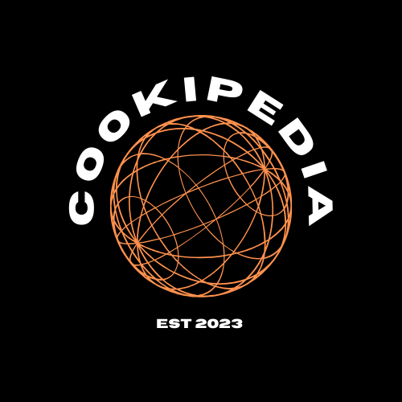

# Cookipedia

Cookipedia is a hackathon project developed during HackPSU, aiming to simplify the cooking experience by automating recipe suggestions based on images of ingredients. This project combines computer vision, machine learning, and natural language processing to take an image, recognize the ingredients from it, and provide a dish suggestion from a preferred cuisine, complete with a recipe.

## Team

Cookipedia was developed by a team of four talented individuals:

- **Eric F**
- **Pranav K**
- **Marmik C**
- **Vlad K**

## Overview

The Cookipedia project employs a three-step approach to provide users with personalized recipe suggestions:

1. **Panoptic Image Segmentation**: This initial step utilizes the Meta SAM model to segment the image and identify individual ingredients.

2. **Ingredient Classification**: The project then employs the Inception 3 model to classify each ingredient, helping the system understand what it is looking at.

3. **Recipe Generation**: Finally, Cookipedia leverages the power of GPT (Generative Pre-trained Transformer) to generate a dish suggestion based on the recognized ingredients and the user's preferred cuisine.

## Code Files

- `Complete_Cookiepedia_flow.ipynb`: This Jupyter Notebook contains algorithms fine-tuned to implement panoptic image segmentation using Meta's SAM and image classification using InceptionV3 models.

- `Index.html`: This file contains all the code for the frontend of the website.

- `serverflask.py`: This Python script integrates the frontend with the machine learning models using Flask APIs.

## How It Works

Cookipedia's workflow can be summarized as follows:

1. **Image Input**: Users provide an image containing the ingredients they want to cook with.

2. **Image Segmentation**: Cookipedia uses Meta SAM to segment the image, identifying each ingredient.

3. **Ingredient Classification**: The Inception 3 model classifies the ingredients into categories such as vegetables, proteins, and spices.

4. **User Preference**: Users specify their preferred cuisine, which influences the recipe suggestions.

5. **Dish Suggestion**: Cookipedia combines the recognized ingredients and user preference to generate a dish suggestion.

6. **Recipe Generation**: The system employs GPT to provide a detailed recipe for the suggested dish.

## Demo

To see Cookipedia in action, please refer to the [demo Markdown file](demo.md). It includes images and examples that showcase the project's capabilities.

---

For any questions or feedback, please contact one of the team members mentioned above. We hope Cookipedia simplifies your cooking experience and inspires you to try new dishes from around the world!

